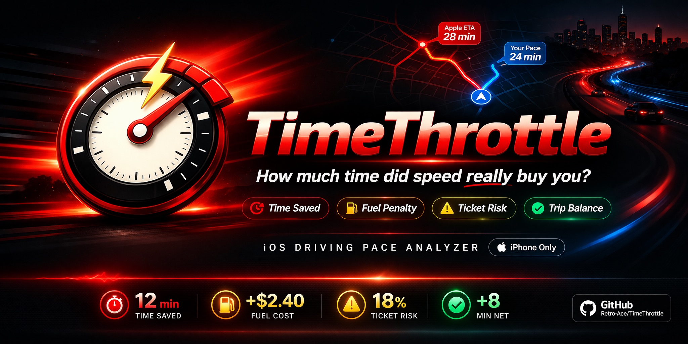

<p align="center">
  
</p>

<h1 align="center">TimeThrottle</h1>

<p align="center">
How much time did speed really buy you?
</p>
# TimeThrottle

**TimeThrottle** is an iPhone pace-analysis app that helps drivers understand what faster driving actually buys them.

The app uses Apple Maps for route lookup and ETA baseline planning, then compares pace tradeoffs such as time saved, time under target pace, fuel penalty, ticket-risk estimate, and overall trip balance.

TimeThrottle does **not** provide built-in turn-by-turn navigation. In **Live Drive**, it can hand off navigation to Apple Maps or Google Maps while TimeThrottle continues tracking the trip and comparing pace tradeoffs.

> **How much time did speed really buy you?**

## What's New in v1.2

Use this block for GitHub, TestFlight, and App Store Connect release copy:

> **TimeThrottle 1.2**
>  
> - Added external navigation handoff for Live Drive
> - Choose Apple Maps, Google Maps, or Ask Every Time
> - Current Location is now the default route start
> - Added Apple Maps-style address autocomplete
> - Cleaned up the Live Drive setup flow
> - Tightened truthful pace-based wording across the app
> - Refined Live Drive, Route, and Manual into a more consistent iPhone experience

## Core Modes

### Live Drive

Live Drive is the real-time trip analysis mode.

It can:
- Capture an Apple Maps route and ETA baseline
- Use Current Location as the default route start
- Offer Apple Maps-style address autocomplete for route setup
- Track speed, distance, and trip progress with iPhone location services
- Compare live projected pace against the Apple ETA baseline
- Estimate time saved, time under target pace, fuel penalty, and trip balance
- Hand off navigation to Apple Maps or Google Maps without claiming built-in navigation

### Route

Route mode compares a planned or completed trip against an Apple Maps route and ETA baseline.

It includes:
- Apple Maps route lookup
- Route options
- Route preview
- Apple ETA baseline
- Pace comparison
- Fuel and ticket-risk estimates
- Comparison bars and trip summary output

### Manual

Manual mode compares two paces across a hand-entered distance.

It includes:
- Distance entry
- Speed A vs Speed B comparison
- Average-speed or trip-duration comparison input
- Fuel assumptions
- Pace, fuel, and ticket-risk tradeoff output

## Navigation Handoff in v1.2

TimeThrottle 1.2 keeps Apple Maps as the planning layer and Apple ETA baseline source.

During Live Drive, users can choose:
- **Apple Maps**
- **Google Maps**
- **Ask Every Time**

When a Live Drive starts, TimeThrottle starts trip tracking first, then opens the selected navigation app if background continuity requirements are met. If Google Maps is not installed, the app falls back cleanly instead of leaving the user stuck.

## Product Positioning

TimeThrottle is a **pace-analysis app**, not a navigation replacement.

The app is designed to answer questions like:
- Did driving faster meaningfully change the trip?
- How much time was actually gained?
- How much time was spent below the target pace?
- What was the fuel penalty?
- Was the overall tradeoff worth it?

## Privacy at a Glance

- No user account is required
- Apple Maps is used for route lookup, autocomplete resolution, and ETA baseline planning
- Live Drive uses iPhone location services when the user enables them
- External navigation handoff is optional
- The preferred navigation app choice is stored locally on-device

For the full policy, see [privacy-policy.md](/Users/anthonylarosa/SPEED%20APP/privacy-policy.md).

## Tech Overview

- **Platform:** iPhone / iOS only
- **Deployment target:** iOS 17+
- **Bundle ID:** `com.timethrottle.app`
- **Current release:** v1.2
- **Current build:** 2
- **Primary app target:** `TimeThrottle.xcodeproj`
- **Primary shared UI:** `Sources/SharedUI/RouteComparisonView.swift`

### Core Components

- `LiveDriveTracker.swift` — Live Drive tracking, permission state, speed, and distance updates
- `TripAnalysisEngine.swift` — live pace/trip summary generation
- `SpeedCostCalculator.swift` — route/manual speed-cost math
- `TimeThrottleCalculator.swift` — manual and segment-based comparison math
- `RouteModels.swift` — shared route, lookup, autocomplete, and mode models
- `NavigationHandoffService.swift` — Apple Maps / Google Maps / Ask Every Time handoff behavior

## Repository Layout

```text
TimeThrottle
├── TimeThrottle.xcodeproj
├── TimeThrottle.xcworkspace
├── README.md
├── CHANGELOG.md
├── privacy-policy.md
├── Assets.xcassets
├── Resources
│   ├── iOS
│   ├── LaunchScreen.storyboard
│   └── TimeThrottleLogo
├── Sources
│   ├── Core
│   ├── SharedUI
│   └── iOS
├── Tests
│   └── CoreTests
├── scripts
└── dist-ios
```

## Build Notes

- Main iOS app scheme: `TimeThrottle`
- Simulator packaging script: `./dist-ios`
- Current packaging path: `dist/iOSSimulator/TimeThrottle.app`
- Generated build outputs live in `build/` and `dist/` and are intentionally git-ignored

## Support

For support or privacy questions, contact: **fixitall329@gmail.com**
