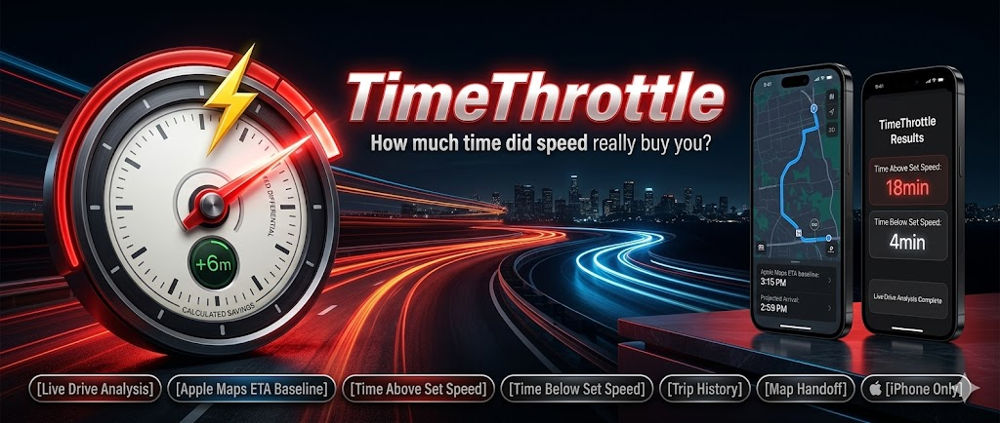

<p align="center">
  
</p>

<h1 align="center">TimeThrottle</h1>

<p align="center">
How much time did speed really buy you?
</p>

> Start here if you are new to this repo.
>
> - This repo is the standalone TimeThrottle codebase only.
> - Read this file first for the product and repo overview.
> - Read `AGENTS.md` for working rules.
> - Read `TimeThrottle_Developer_Handoff.md` for the quickest handoff/status summary.
> - Read `TimeThrottle_Master_Project_Doc.md` for a fuller current-state reference.
> - Read `TimeThrottle_Full_Project_Breakdown.txt` last if you need the longest plain-text breakdown.

**TimeThrottle** is an iPhone Live Drive pace-analysis app.

Apple Maps provides route lookup, autocomplete, route options, and the ETA baseline. TimeThrottle then tracks your real drive and shows:
- Time Above Speed Limit
- Time Below Speed Limit
- projected arrival versus Apple Maps ETA baseline

TimeThrottle now adds in-app guidance and route intelligence on top of the Apple Maps route data. It is not an Apple Maps replacement: external handoff to Apple Maps, Google Maps, or Waze remains available while TimeThrottle continues tracking the trip.

## What's New in v2.0

Use this block for GitHub releases, TestFlight notes, and App Store Connect:

> **TimeThrottle 2.0**
>
> - Adds a fourth Scanner tab for informational public scanner listening
> - Adds Nearby and Browse scanner system discovery using an OpenMHz-style public scanner client
> - Shows latest public scanner calls for a selected system
> - Adds scanner audio playback with background audio support when the user starts playback
> - Keeps Scanner independent from Live Drive, route intelligence, and driving calculations

## Core Product

### Live Drive

Live Drive is the full product.

It supports:
- Apple Maps route lookup and ETA baseline
- Current Location as the default start
- Apple Maps-style address autocomplete
- route options and route preview
- live GPS tracking
- pause, resume, and end trip controls
- a map-first active driving HUD in the Map tab
- in-app guidance based on Apple Maps route steps
- route weather checkpoints expected around arrival time
- OpenStreetMap speed limit estimates where available
- optional nearby low aircraft display
- optional passive enforcement alerts when a configured source is available
- Trip History for completed drives
- shareable finished-trip summaries
- optional navigation handoff to Apple Maps, Google Maps, or Waze
- bottom navigation for Drive, Map, Trips, and Scanner

### Scanner

Scanner is separate from Live Drive.

It supports:
- public scanner listening
- Nearby scanner systems when location access is available
- Browse and search by system name, short name, city, county, or state
- latest public scanner calls for a selected system
- simple play / pause / next-call playback
- background audio while scanner playback is active

Scanner uses an OpenMHz-style API client with a configurable base URL. It can point to a hosted OpenMHz endpoint, a self-hosted OpenMHz endpoint, or a compatible backend later. Scanner is listening only: TimeThrottle does not record scanner audio, does not upload scanner feeds, and does not use scanner audio for Live Drive, route warnings, incident prediction, or driving recommendations.

### Map Tab Driving HUD

The Map tab is the primary active driving view built from real TimeThrottle trip state.

It shows:
- a full-width live map with route polyline, current location, aircraft markers, enforcement alert markers when available, and recenter control
- next maneuver and distance based on Apple Maps route steps
- a compact floating weather chip when route forecast data is available
- a compact nearest-aircraft bar when the aircraft layer is enabled and data exists
- voice guidance mute / unmute control
- Current Speed
- Speed Limit estimate or Unavailable state
- Apple Maps ETA as the Apple Maps baseline
- Arrive as projected arrival in the destination's local time when available
- remaining route distance
- distance driven
- Pause / Resume and End Trip controls without opening Options
- Options for route intelligence details

The Map Options sheet holds:
- route weather status and forecast checkpoints
- optional Nearby Low Aircraft status and details
- optional passive Enforcement Alerts when configured
- local voice guidance settings
- speed-limit source and confidence details
- Time Above Speed Limit
- Time Below Speed Limit
- average speed
- top speed
- Standard / Satellite map mode

Aircraft, enforcement, weather, and speed-limit data are informational and coverage varies by source, region, route, and app configuration.

The Map follows the user during a drive, stops following if the user pans away, and provides a clear recenter control. Route guidance is based on Apple Maps route data; it is not Apple-native navigation or lane guidance.

## Trip Results

Finished trips focus on the pace story:
- **Time Above Speed Limit** = measured time spent above available OpenStreetMap speed-limit estimates
- **Time Below Speed Limit** = measured time spent below available OpenStreetMap speed-limit estimates
- **Overall vs Apple ETA baseline** = the finished trip result against the Apple Maps ETA baseline

Speed-limit analysis only includes route segments where an OpenStreetMap speed-limit estimate was available.

## Navigation Handoff

TimeThrottle keeps Apple Maps as the route-planning and ETA-baseline layer.

In-app guidance is based on Apple Maps route steps. TimeThrottle does not claim lane guidance, certified speed-limit accuracy, live traffic ownership, aviation safety alerts, or Apple-native navigation behavior.

During Live Drive, users can choose:
- **Apple Maps**
- **Google Maps**
- **Waze**
- **Ask Every Time**

TimeThrottle starts tracking first, then opens the selected navigation app if background-location requirements are met.

## Privacy at a Glance

- No user account is required
- Apple Maps is used for route lookup, autocomplete resolution, route options, and ETA baseline planning
- WeatherKit may be used for route weather forecasts near sampled route checkpoints
- OpenStreetMap may be queried and locally cached for speed-limit estimates where available
- OpenSky ADS-B may be queried on a conservative refresh interval when the optional passive Nearby Low Aircraft layer is enabled; stale or unavailable data is handled quietly and is not a safety system
- Optional enforcement alerts may use configured provider or open-data lookups where available; coverage varies by region and alerts are not guaranteed legal or enforcement guidance
- Scanner may use location to find nearby public scanner systems when Scanner Nearby is used
- Scanner audio comes from third-party public scanner feed providers; TimeThrottle does not record scanner audio
- Scanner playback can continue in the background when the user starts scanner audio
- Live Drive uses iPhone location services when the user enables them
- Completed Live Drive trips are stored locally on-device
- The preferred navigation app choice is stored locally on-device
- The selected local iOS guidance voice, mute state, and speech speed are stored locally on-device
- Sharing only happens when the user explicitly uses the iOS share sheet

For the full policy, see [privacy-policy.md](/Users/anthonylarosa/CODEX/TimeThrottle/privacy-policy.md).

## Tech Overview

- **Platform:** iPhone / iOS only
- **Deployment target:** iOS 17+
- **Bundle ID:** `com.timethrottle.app`
- **Current release:** v2.0
- **Current build:** 18
- **Primary app target:** `TimeThrottle.xcodeproj`
- **Primary shared UI:** `Sources/SharedUI/RouteComparisonView.swift`

### Core Components

- `LiveDriveTracker.swift` — Live Drive tracking, permission state, speed, and distance updates
- `TurnByTurnGuidanceEngine.swift` — Apple Maps route-step guidance, speech prompts, off-route detection, and reroute request foundation
- `VoiceGuidanceSettings.swift` — local iOS system voice settings and best-available English voice selection
- `WeatherRouteProvider.swift` — route checkpoint sampling and WeatherKit forecast pipeline
- `SpeedLimitProvider.swift` / `OSMSpeedLimitService.swift` / `OSMSpeedLimitProvider.swift` — speed-limit estimate protocol, current-road OpenStreetMap lookup, and local cache wrapper
- `AircraftProvider.swift` / `OpenSkyAircraftProvider.swift` — optional passive Nearby Low Aircraft models and OpenSky implementation
- `EnforcementAlertProvider.swift` — optional camera and enforcement report model/provider/service foundation
- `ScannerModels.swift` — public scanner system, call, talkgroup, nearby sorting, and geocode cache models
- `OpenMHzScannerService.swift` — configurable OpenMHz-style scanner API client for systems, latest calls, and talkgroups
- `TripHistoryStore.swift` — local persistence for completed Live Drive trips
- `TripAnalysisEngine.swift` — live pace and trip summary generation
- `PaceAnalysisMath.swift` — shared speed-limit comparison helper
- `RouteModels.swift` — shared route, lookup, autocomplete, and navigation-provider models
- `LiveDriveHUDView.swift` — legacy compact driving-view component retained internally while Map is the primary driving HUD
- `LiveDriveHUDMapView_iOS.swift` — Map follow, route polyline, user location, aircraft markers, enforcement alert markers, and recenter behavior
- `NavigationHandoffService.swift` — Apple Maps / Google Maps / Waze / Ask Every Time handoff behavior
- `ScannerViewModel.swift` — Scanner tab systems, Nearby/Browse, selected system, latest calls, and player state
- `ScannerTabView.swift` — Scanner tab UI, system lists, selected-system detail, latest calls, and player controls

## Repository Layout

```text
TimeThrottle
├── TimeThrottle.xcodeproj
├── README.md
├── CHANGELOG.md
├── privacy-policy.md
├── Assets.xcassets
├── Resources
├── Sources
│   ├── Core
│   ├── SharedUI
│   └── iOS
├── Tests
├── scripts
└── dist-ios
```

## Build Notes

- Main iOS app scheme: `TimeThrottle`
- Simulator packaging script: `./dist-ios`
- Current packaging path: `dist/iOSSimulator/TimeThrottle.app`
- Generated build outputs live in `build/` and `dist/` and are intentionally git-ignored

## Support

For support or privacy questions, contact: **fixitall329@gmail.com**
